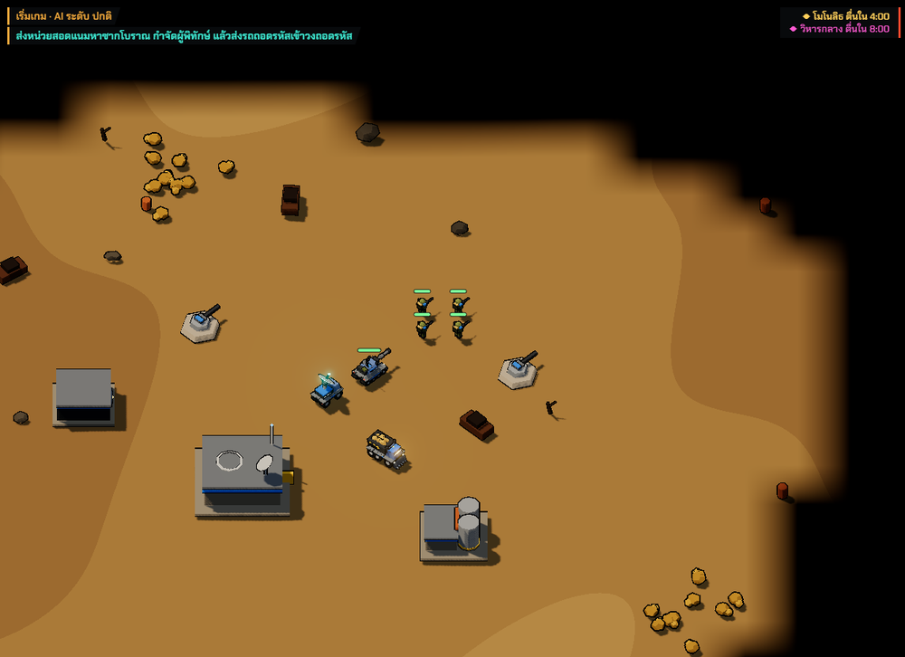
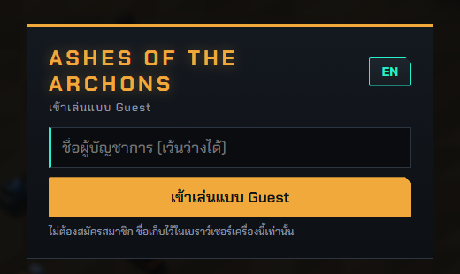
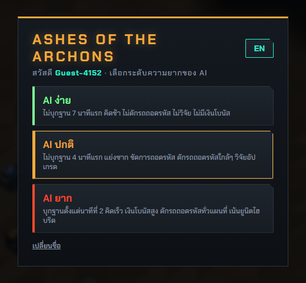
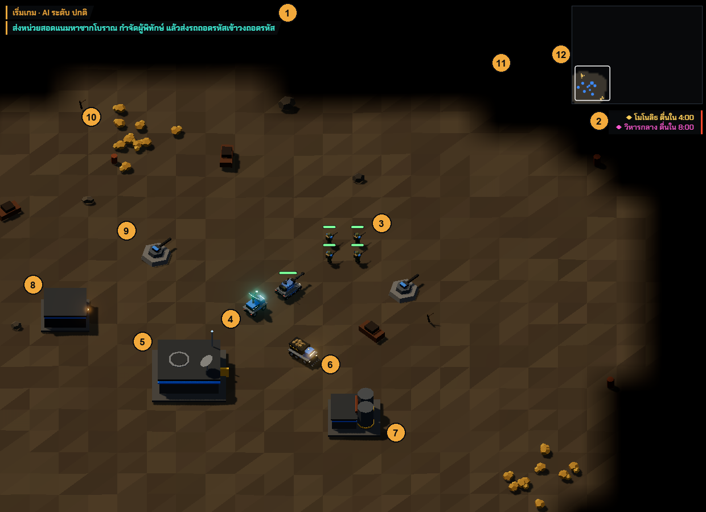
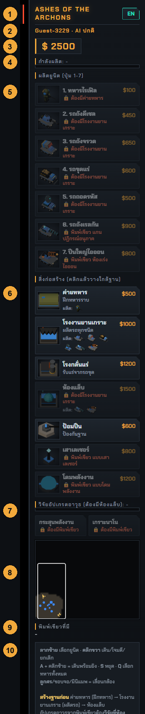
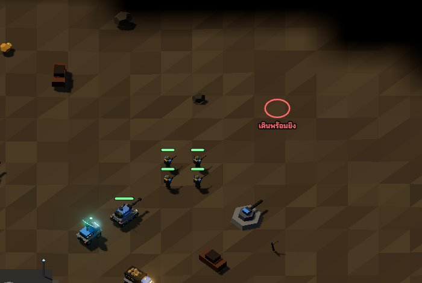
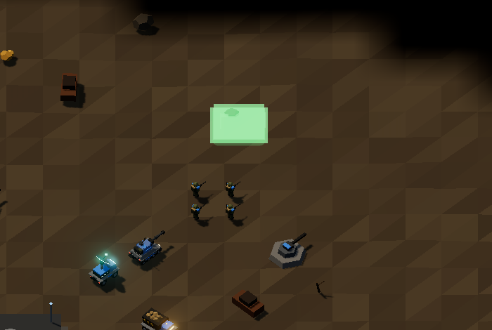
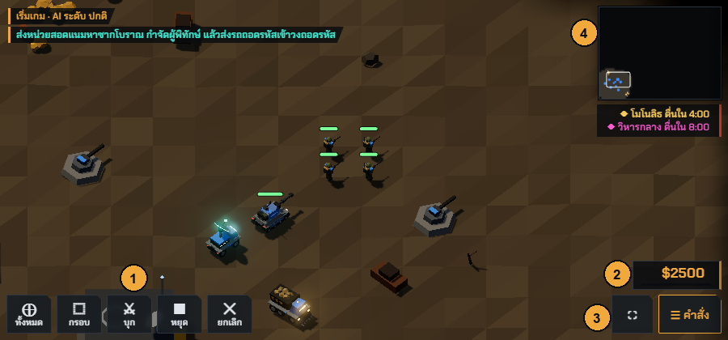
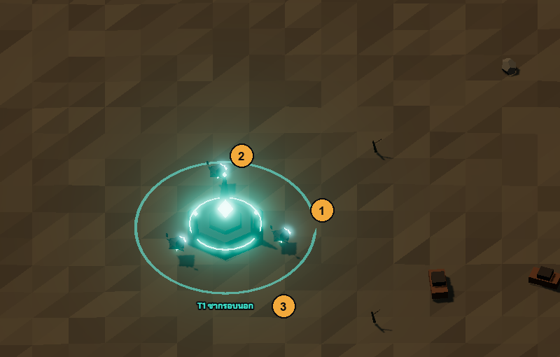
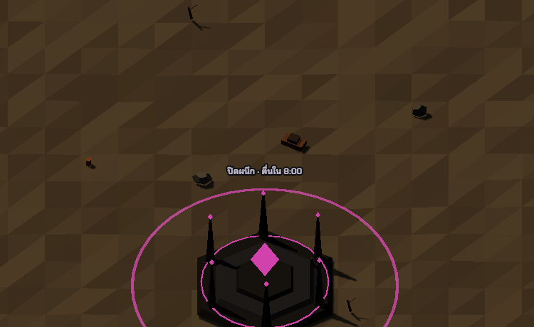

# Ashes of the Archons

เกมวางแผนการรบแบบเรียลไทม์ (RTS) เล่นบนเว็บเบราว์เซอร์ ได้แรงบันดาลใจจาก Red Alert 2
ผสมกับการขุดค้นเทคโนโลยีโบราณ: ส่งทัพไปยึดซากอารยธรรม Archon ถอดรหัสเอาพิมพ์เขียวอาวุธ
แล้วใช้มันทำลายศูนย์บัญชาการของศัตรู



- เล่นกับ AI ได้ 3 ระดับ แมตช์หนึ่งยาวประมาณ 15–25 นาที
- ภาพ 3D แบบ low-poly มุมกล้องเฉียงแบบ RA2 โมเดลทุกชิ้นสร้างด้วยโค้ด ไม่ใช้ไฟล์ 3D ภายนอก
- เล่นได้ทั้งเมาส์ + คีย์บอร์ด และจอสัมผัส (มือถือ/แท็บเล็ตแนวนอน)
- สลับภาษาไทย / อังกฤษได้ในเกม

---

## เริ่มต้นใช้งาน

ต้องมี [Node.js](https://nodejs.org/) เวอร์ชัน 20.19 ขึ้นไป (Vite 8 ต้องการ)

```bash
npm install
npm run dev        # หน้า landing ที่ http://localhost:5173/ ตัวเกมที่ http://localhost:5173/play/
```

`npm run dev` เปิดให้เครื่องอื่นในวง LAN เดียวกันเข้าได้ด้วย จึงลองเล่นบนมือถือได้ทันที
ใช้ที่อยู่ `Network:` ที่ Vite แสดงในหน้าต่างคำสั่ง (เช่น `http://192.168.1.10:5173/`)

| คำสั่ง | ใช้ทำอะไร |
|---|---|
| `npm run dev` | รันเซิร์ฟเวอร์สำหรับพัฒนา (แก้โค้ดแล้วหน้าเว็บรีโหลดเอง) |
| `npm run build` | ตรวจ TypeScript แล้วสร้างไฟล์สำหรับเผยแพร่ในโฟลเดอร์ `dist/` |
| `npm run preview` | เปิดดูไฟล์ใน `dist/` ที่ build แล้ว |
| `npm start` | รันเซิร์ฟเวอร์ production (`server/index.mjs`) เสิร์ฟ `dist/` + `/api/stats` ที่ http://localhost:8080/ |
| `npm run typecheck` | ตรวจ TypeScript อย่างเดียว |

### ตัวเลือกในที่อยู่ (URL)

| ใส่ต่อท้าย | ผล |
|---|---|
| `?style=toon` | ภาพสไตล์การ์ตูน ลงเงาเป็นขั้น มีเส้นขอบดำ |
| `?q=low` / `?q=high` | ปิด / เปิด เงาและแสงเรือง (มือถือใช้ `low` อัตโนมัติ) |
| `?touch` | บังคับใช้หน้าตาแบบจอสัมผัส (ไว้ทดสอบบนคอม) |
| `#reveal` หรือ `#reveal@1600,1200` | เปิดดูทั้งแผนที่ และย้ายกล้องไปจุดที่ระบุ (ใช้ได้เฉพาะตอน `npm run dev`) |

ตัวเลือกเหล่านี้ใช้กับหน้าเกม `/play/` ใส่หลายตัวพร้อมกันได้ เช่น `http://localhost:5173/play/?style=toon&q=high`

---

## ไกด์หน้าจอเกม

### 1. เข้าเกม

| เข้าเล่นแบบ Guest | เลือกระดับ AI |
|---|---|
|  |  |

1. พิมพ์ชื่อผู้บัญชาการ (เว้นว่างได้) แล้วกด **เข้าเล่นแบบ Guest** ไม่ต้องสมัครสมาชิก ชื่อเก็บไว้ในเบราว์เซอร์เครื่องนี้เท่านั้น
2. เลือกระดับความยากของ AI เกมเริ่มทันทีที่กด ปุ่ม **EN / ไทย** มุมขวาบนใช้สลับภาษาได้ตลอด

| ระดับ | พฤติกรรมของ AI |
|---|---|
| **ง่าย** | ไม่บุกฐาน 7 นาทีแรก คิดช้า ไม่ดักรถถอดรหัส ไม่วิจัย ไม่มีเงินโบนัส |
| **ปกติ** | ไม่บุกฐาน 4 นาทีแรก แย่งซาก ขัดการถอดรหัส ดักรถถอดรหัสที่อยู่ใกล้ วิจัยอัปเกรด |
| **ยาก** | บุกตั้งแต่นาทีที่ 2 คิดเร็ว มีเงินโบนัสสูง ดักรถถอดรหัสทั่วแผนที่ เน้นยูนิตไฮบริด |

ทุกระดับใช้ยูนิตที่พลังเท่ากับของผู้เล่น ไม่มีการโกง ต่างกันที่ความเร็วในการคิด ขนาดทัพที่บุก รายได้โบนัส และพฤติกรรมที่เปิดใช้

### 2. สนามรบ



| # | ส่วนของจอ | รายละเอียด |
|---|---|---|
| 1 | **ข้อความแจ้งเตือน** | เหตุการณ์ล่าสุด เช่น เริ่มก่อสร้าง ถูกโจมตี ได้พิมพ์เขียว ค่อยๆ จางหายไปเอง |
| 2 | **แผงนับถอยหลัง** | อยู่ใต้มินิแมพ บอกเวลาที่ซากโบราณจะตื่น เงินที่ได้จากซากที่ยึดไว้ และคำเตือนซูเปอร์เวพอนของศัตรู |
| 3 | **ยูนิตที่เลือกอยู่** | มีวงสีเขียวใต้ตัวและแถบเลือดเหนือหัว สีแถบเปลี่ยนจากเขียว → เหลือง → แดง ตามเลือดที่เหลือ |
| 4 | **รถถอดรหัส** (Rig) | ยูนิตสำคัญที่สุด ใช้ถอดรหัสซากโบราณ และขนแกนข้อมูลกลับฐาน |
| 5 | **ศูนย์บัญชาการ** | หัวใจของฐาน ถ้าถูกทำลายคือแพ้ |
| 6 | **รถขุดแร่** | วิ่งไปเก็บแร่เองอัตโนมัติ แล้วนำกลับมาส่งโรงกลั่น |
| 7 | **โรงกลั่นแร่** | จุดรับแร่ แร่ที่ส่งถึงจะกลายเป็นเงิน |
| 8 | **คลังพิมพ์เขียว** | เก็บพิมพ์เขียวที่ได้มา ถ้าถูกทำลาย พิมพ์เขียว 2 แผ่นจะหล่นกระจายให้ใครก็เก็บได้ |
| 9 | **ป้อมปืน** | ป้องกันฐาน ยิงศัตรูที่เข้ามาในระยะเอง |
| 10 | **แหล่งแร่** | แร่ทอง (เก็บได้ตั้งแต่แรก) และแร่ม่วง Xenite (ต้องมีพิมพ์เขียวเครื่องสแกนแร่ลึก มูลค่า 3 เท่า) |
| 11 | **หมอกสงคราม** | สีดำ = ยังไม่เคยสำรวจ, มืดครึ่งหนึ่ง = เคยเห็นแต่ตอนนี้ไม่มียูนิตอยู่ใกล้ (เห็นแค่อาคาร), สว่าง = มองเห็นตอนนี้ |
| 12 | **มินิแมพ** | มุมขวาบนของจอ คลิกหรือลาก (ใช้นิ้วก็ได้) เพื่อย้ายกล้อง กรอบสีขาวคือบริเวณที่เห็นบนจอ จุดสีคือยูนิต/อาคาร วงกลมคือซากโบราณ |

### 3. แผงคำสั่งด้านขวา



| # | ส่วน | รายละเอียด |
|---|---|---|
| 1 | **ชื่อเกม + ปุ่มภาษา + ปุ่มออก** | กด EN / ไทย เพื่อสลับภาษา · กด **ออก** เพื่อออกจากเกม (ดูหัวข้อถัดไป) |
| 2 | **ชื่อผู้เล่น · ระดับ AI** | |
| 3 | **เงิน** | ใช้ผลิตยูนิต สร้างอาคาร และวิจัย |
| 4 | **กำลังผลิต** | ยูนิตที่กำลังผลิตอยู่ และจำนวนที่รอคิว พร้อมแถบความคืบหน้า (แถบเดียวกันขึ้นที่ขอบล่างของปุ่มยูนิตนั้นด้วย) |
| 5 | **ผลิตยูนิต** | คลิก (หรือกดปุ่ม 1–7) เพื่อเข้าคิวผลิต ถ้ายังผลิตไม่ได้ จะมี 🔒 บอกเหตุผลเป็นตัวแดง เช่น ยังไม่มีอาคารที่ต้องใช้ หรือยังไม่มีพิมพ์เขียว ตัวเลข ×2 ที่มุมคือจำนวนในคิว |
| 6 | **สิ่งก่อสร้าง** | คลิกแล้ววางลงบนแผนที่ใกล้ฐาน แถว "ผลิต:" บอกว่าอาคารนั้นปลดล็อกยูนิตอะไร |
| 7 | **วิจัยอัปเกรดอาวุธ** | ต้องมีห้องแล็บ + พิมพ์เขียวอาวุธก่อน จึงวิจัยได้ |
| 8 | **พิมพ์เขียวที่มี** | รายการพิมพ์เขียวที่ได้มาแล้ว |
| 9 | **วิธีเล่นย่อ** | สรุปปุ่มควบคุมและกติกาไว้ในเกม |

เมื่อส่งแกนข้อมูลถึงฐาน จะมีกล่อง **เลือกพิมพ์เขียว** สีฟ้าเขียวโผล่ขึ้นมาเหนือปุ่มผลิต
ให้เลือก 1 จากตัวเลือกที่สุ่มมา (หมวดอาวุธ / สิ่งก่อสร้าง / ทรัพยากร)
เมื่อได้แกนโบราณจากวิหารกลาง จะมีแถบชาร์จและปุ่ม **ยิงลำแสงจากวงโคจร** เพิ่มขึ้นมา

<br clear="right">

### 4. สั่งการยูนิต

| เดินพร้อมยิง (A + คลิก) | วางสิ่งก่อสร้าง |
|---|---|
|  |  |

- **เดินพร้อมยิง:** กด `A` แล้วคลิกซ้ายที่พื้น เคอร์เซอร์จะเป็นวงสีแดง ยูนิตจะเดินไปจุดนั้นและยิงศัตรูที่เจอระหว่างทาง
- **วางอาคาร:** คลิกปุ่มอาคารแล้วเลื่อนเมาส์ไปบนแผนที่ จะเห็นอาคารโปร่งแสง สีเขียว = วางได้, สีแดง = วางไม่ได้ (ต้องใกล้ฐานและไม่ทับอะไร) คลิกซ้ายเพื่อวาง คลิกขวาหรือ `Esc` เพื่อยกเลิก อาคารจะค่อยๆ สูงขึ้นระหว่างก่อสร้าง และมีแถบสีเหลืองบอกความคืบหน้า

#### เมาส์ + คีย์บอร์ด

| ปุ่ม | การทำงาน |
|---|---|
| ลากซ้าย | ตีกรอบเลือกยูนิต ยูนิตที่จะถูกเลือกขึ้นวงเขียวระหว่างลาก (คลิกซ้ายครั้งเดียว = เลือกตัวเดียว) |
| คลิกขวาที่พื้น | เดินไปจุดนั้น |
| คลิกขวาที่ศัตรู | สั่งโจมตีเป้านั้น |
| `A` + คลิกซ้าย | เดินพร้อมยิง |
| `S` | หยุด |
| `Q` | เลือกทหารทุกหน่วยที่ต่อสู้ได้ |
| `1`–`7` | ผลิตยูนิตตามลำดับปุ่ม |
| `Esc` / คลิกขวา | ยกเลิกโหมดวางอาคาร / เล็งเป้า |
| ล้อเมาส์ | ซูมเข้า–ออก (จุดใต้เมาส์อยู่กับที่) |
| ลูกศร / ชิดขอบจอ / ปุ่มกลางเมาส์ลาก / มินิแมพ | เลื่อนกล้อง |

#### จอสัมผัส



1. **ปุ่มคำสั่ง:** ⊕ ทั้งหมด (เลือกทหารทุกหน่วย) · ⬚ กรอบ (กดแล้วลากนิ้วเพื่อตีกรอบเลือก) · ⚔ บุก · ■ หยุด · ✕ ยกเลิก
2. **เงิน + คิวผลิต:** เห็นตลอดโดยไม่ต้องเปิดแผงคำสั่ง ⚙ บอกจำนวนในคิว แถบสีฟ้าบอกความคืบหน้า
3. **⛶ เต็มจอ · ☰ คำสั่ง:** เปิดแผงคำสั่งซึ่งเลื่อนออกมาจากขวา ปุ่มยูนิต/อาคารเรียง 2 ช่องต่อแถวเน้นรูป ถ้ายังล็อกอยู่รูปจะเป็นสีเทามีกุญแจ แตะเพื่อดูเหตุผล กด ✕ มุมบนเพื่อปิด
4. **มินิแมพ:** แตะหรือลากเพื่อย้ายกล้อง

| ท่า | การทำงาน |
|---|---|
| แตะยูนิตเรา | เลือก (แตะซ้ำเร็วๆ = เลือกยูนิตชนิดเดียวกันทั้งจอ) |
| แตะพื้น / ศัตรู | เดิน / โจมตี |
| ลากนิ้วเดียว | เลื่อนแผนที่ |
| กดค้าง 0.35 วินาทีแล้วลาก หรือกดปุ่ม ⬚ แล้วลาก | ตีกรอบเลือก |
| สองนิ้ว | เลื่อนแผนที่ + บีบเพื่อซูม |

ต้องถือจอแนวนอน ถ้าถือแนวตั้งเกมจะขึ้นข้อความให้หมุนจอ

### 5. ซากโบราณ

| ซากรอบนอก (T1) พร้อมผู้พิทักษ์ | วิหารกลาง (T3) ยังปิดผนึก |
|---|---|
|  |  |

1. **วงถอดรหัส:** ส่งรถถอดรหัสเข้าไปในวงเพื่อเริ่มถอดรหัส จะมีวงแสดงความคืบหน้าเป็น %
2. **ผู้พิทักษ์:** หุ่นโบราณเฝ้าซากไว้ ต้องกำจัดก่อน ไม่อย่างนั้นรถถอดรหัสจะถูกยิง
3. **ชื่อและสถานะ:** บอกชื่อซาก สถานะ (ปิดผนึก / กำลังถอดรหัส / ถูกขัดขวาง / ครอบครองโดยใคร) และเปอร์เซ็นต์ความคืบหน้า

### 6. ออกจากเกม

กดปุ่ม **ออก** ที่หัวแผงคำสั่ง (หรือปุ่ม **ออกจากเกม** ตอนจบแมตช์) เกมจะหยุดชั่วคราวและถามยืนยัน
กด **เล่นต่อ** หรือ `Esc` เพื่อกลับไปเล่น กด **ออกจากเกม** จะกลับไปหน้า landing ตรงส่วนสนับสนุน พร้อมข้อความขอบคุณ
ส่วนนั้นมีลิงก์โดเนท [ezdn.app/ellou](https://ezdn.app/ellou) และ QR PromptPay ให้สนับสนุนผู้พัฒนา สแกนด้วยแอปธนาคารใดก็ได้ จำนวนเท่าไรก็ได้

---

## วิธีเล่นและกติกา

**เป้าหมาย: ทำลายศูนย์บัญชาการของศัตรู**

1. **สร้างฐาน:** ค่ายทหาร → โรงงานยานเกราะ (ต้องมีโรงกลั่นแร่ก่อน) → ห้องแล็บ ส่งรถขุดแร่ไปหาเงิน
2. **ถอดรหัสซากโบราณ:** กำจัดผู้พิทักษ์ แล้วส่งรถถอดรหัสเข้าวง ซากแต่ละแห่งถอดรหัสได้ครั้งเดียว
3. **ขนแกนข้อมูลกลับฐาน:** ถอดรหัสเสร็จ รถถอดรหัสจะขนแกนข้อมูลกลับไปที่คลังพิมพ์เขียว ระหว่างขนจะวิ่งช้าลง และ **ทุกฝ่ายมองเห็นรถคันนั้น** ถ้ารถถูกทำลาย แกนข้อมูลจะหล่นให้ใครก็เก็บได้
4. **เลือกพิมพ์เขียว:** ของถึงฐานแล้วเลือกพิมพ์เขียว 1 แผ่น พิมพ์เขียวอาวุธต้องไปวิจัยต่อที่ห้องแล็บ
5. **ยึดจุด:** ซากที่ถอดรหัสแล้วกลายเป็นจุดยึด ยืนในวงฝ่ายเดียว 10 วินาทีเพื่อยึด ได้เงินต่อเนื่อง
6. **ซูเปอร์เวพอน:** ขนแกนโบราณจากวิหารกลางกลับฐานได้ ลำแสงวงโคจรจะเริ่มชาร์จ (120 วินาที) ยิงแล้วสร้างความเสียหายรุนแรงในรัศมีกว้าง ถ้าครอบครองวิหารกลางไว้ได้ด้วย ลำแสงจะชาร์จเร็วขึ้น 2 เท่า

| ซาก | ตื่นเมื่อ | ถอดรหัสแล้วได้ | ยึดแล้วได้ |
|---|---|---|---|
| ◆ T1 ซากรอบนอก | ตั้งแต่เริ่ม | พิมพ์เขียว T1 (หรือ $800 ถ้าได้ครบแล้ว) | +$4 / วินาที |
| ◆ T2 โมโนลิธ | นาทีที่ 4 | พิมพ์เขียว T2 (หรือ $1500) | +$8 / วินาที |
| ◆ T3 วิหารกลาง | นาทีที่ 8 | แกนโบราณ → ลำแสงวงโคจร | ชาร์จซูเปอร์เวพอน x2 |

เกมจะเตือนล่วงหน้า 45 วินาทีก่อนซากตื่น และบอกตำแหน่งบนแผนที่

### ยูนิต

| ปุ่ม | ยูนิต | ราคา | ต้องมี | บทบาท |
|---|---|---|---|---|
| 1 | ทหารไรเฟิล | $100 | ค่ายทหาร | ทหารราบ สู้ทหารราบ |
| 2 | รถถังดีเซล | $450 | โรงงานยานเกราะ | รถถังหลัก สู้ได้ทุกอย่าง |
| 3 | รถถังจรวด | $650 | โรงงานยานเกราะ | ยิงจรวดคู่ แรงกับรถและอาคาร อ่อนกับทหารราบ |
| 4 | รถขุดแร่ | $600 | โรงงานยานเกราะ | เก็บแร่หาเงิน |
| 5 | รถถอดรหัส | $500 | โรงงานยานเกราะ | ถอดรหัสซากโบราณ ขนแกนข้อมูล |
| 6 | รถถังเรลกัน | $900 | โรงงาน + ห้องแล็บ + พิมพ์เขียวแกนปฏิกรณ์อนุภาค | ยิงไกล แรงมาก |
| 7 | ปืนใหญ่ไอออน | $800 | โรงงาน + ห้องแล็บ + พิมพ์เขียวห้องเร่งไอออน | ยิงไกลที่สุด ระเบิดเป็นวง |

### สิ่งก่อสร้าง

| อาคาร | ราคา | ต้องมี | หน้าที่ |
|---|---|---|---|
| ค่ายทหาร | $500 | – | ฝึกทหารราบ |
| โรงกลั่นแร่ | $1200 | – | รับแร่จากรถขุด |
| โรงงานยานเกราะ | $1000 | โรงกลั่นแร่ | ผลิตรถทุกชนิด |
| ห้องแล็บ | $1500 | โรงงานยานเกราะ | วิจัยอัปเกรด + ปลดล็อกยูนิตไฮบริด |
| ป้อมปืน | $600 | – | ป้องกันฐาน |
| เสาเลเซอร์ | $800 | ห้องแล็บ + พิมพ์เขียว | ป้องกันระยะไกล ยิงลำแสง |
| โดมพลังงาน | $1200 | ห้องแล็บ + พิมพ์เขียว | ลดความเสียหายที่ได้รับ 50% ภายในวง |

### พิมพ์เขียว

| Tier | ชื่อ | หมวด | ผล |
|---|---|---|---|
| 1 | กระสุนพลังงาน | อาวุธ | วิจัยที่แล็บ ($800): ทหารไรเฟิลและรถถังดีเซล ดาเมจ +30% |
| 1 | เกราะนาโน | อาวุธ | วิจัยที่แล็บ ($1000): เลือดทหารราบ +50% รถ +20% |
| 1 | แบบเสาเลเซอร์ | สิ่งก่อสร้าง | สร้างเสาเลเซอร์ได้ |
| 1 | เครื่องสแกนแร่ลึก | ทรัพยากร | รถขุดเก็บแร่ม่วง Xenite ได้ มูลค่า 3 เท่า |
| 2 | แกนปฏิกรณ์อนุภาค | อาวุธ | ปลดล็อกรถถังเรลกัน |
| 2 | ห้องเร่งไอออน | อาวุธ | ปลดล็อกปืนใหญ่ไอออน |
| 2 | แบบโดมพลังงาน | สิ่งก่อสร้าง | สร้างโดมพลังงานได้ |
| 2 | เครื่องแปรรูปแร่ | ทรัพยากร | แร่พื้นฐานได้เงินเพิ่ม 2 เท่า |

ถ้าคลังพิมพ์เขียวถูกทำลาย พิมพ์เขียว 2 แผ่นจะหล่นกระจายและเสียผลของมันไป จนกว่าจะส่งรถถอดรหัสไปเก็บคืน
คลังของศัตรูก็เช่นกัน ถ้าทำลายได้ก็เก็บพิมพ์เขียวของศัตรูมาได้

---

## สำหรับนักพัฒนา

### เทคโนโลยี

- **TypeScript + Vite**
- **Three.js:** ภาพ 3D โมเดลทุกชิ้นประกอบจากรูปทรงพื้นฐานในโค้ด ยูนิตชนิดเดียวกันวาดรวมใน draw call เดียว (InstancedMesh) มี bloom ให้ของโบราณเรืองแสง หมอกสงครามคำนวณใน shader
- **HTML/CSS:** แผงคำสั่ง ปุ่ม และหน้าเริ่มเกม

### โครงสร้างโปรเจกต์

```
index.html         หน้า landing ภาษาไทย (/)
en/index.html      หน้า landing ภาษาอังกฤษ (/en/)
play/index.html    ตัวเกม (/play/)
public/            ไฟล์ที่คัดลอกไปตรงๆ: robots.txt, sitemap.xml, favicon, ภาพหน้าจอสำหรับ landing (img/)
server/index.mjs   เซิร์ฟเวอร์ production: เสิร์ฟไฟล์ + /api/stats (ยอดจาก GA4)
src/
  main.ts          เริ่มเกม + game loop
  analytics.ts     Google Analytics 4 + แถบขอความยินยอมคุกกี้ (ใช้ทั้ง landing และเกม)
  landing/         สคริปต์และ CSS ของหน้า landing
  sim/             ตรรกะของเกมทั้งหมด (ไม่อ้างถึงการวาดภาพ)
    data.ts          ค่าของยูนิต อาคาร พิมพ์เขียว ซาก ระดับ AI — ปรับสมดุลเกมที่ไฟล์นี้ที่เดียว
    state.ts         สถานะเกม (S) และชนิดข้อมูล
    update.ts        อัปเดตเกมหนึ่งจังหวะ
    units.ts combat.ts production.ts ruins.ts fog.ts ai.ts world.ts i18n.ts
  render/          การวาดภาพ 3D
    scene3d.ts       ตัววาดหลัก: พื้น ยูนิต เอฟเฟกต์ หมอกสงคราม แถบเลือด/ป้ายข้อความ
    models.ts        โมเดล low-poly ของยูนิต อาคาร ซาก สร้างด้วยโค้ด
    camera.ts        กล้องมุมเฉียง + แปลงพิกัดจอ ↔ แผนที่
    toon.ts          สไตล์ toon (cel-shading + เส้นขอบ)
  ui/
    hud.ts           แผงคำสั่ง มินิแมพ หน้าเริ่มเกม สลับภาษา
    input.ts         เมาส์ คีย์บอร์ด จอสัมผัส
    exit.ts          ปุ่มออกจากเกม → กลับหน้า landing ส่วนสนับสนุน (QR PromptPay อยู่ที่ src/assets/)
  lowpoly/main.ts  หน้าทดลองภาพ (lowpoly.html / toon.html) ปล่อยทัพให้สองฝ่ายสู้กันเพื่อทดสอบความลื่น
docs/GAME_PLAN.md  แผนพัฒนาเกมฉบับเต็ม
legacy/            ตัววาด 2D (PixiJS) รุ่นเก่า และต้นแบบแรก เก็บไว้อ้างอิง
Dockerfile         build เว็บแล้วรันด้วย server/index.mjs
.github/workflows/ CI/CD: ตรวจ build → สร้าง Docker image
```

หลักสำคัญ: `sim/` ไม่รู้จักการวาดภาพเลย ส่วน `render/` อ่านสถานะจาก `sim/` เพื่อวาดอย่างเดียว ไม่แก้ค่าอะไร
จึงเปลี่ยนวิธีวาดได้โดยไม่กระทบกติกาเกม (เกมเปลี่ยนจาก 2D เป็น 3D มาแล้วด้วยวิธีนี้)

### Deploy

เว็บเป็นไฟล์ static (ใน `dist/`) กับเซิร์ฟเวอร์ Node ตัวเล็กที่ไม่มี dependency ([server/index.mjs](server/index.mjs)) ในโปรเจกต์เตรียม Docker ไว้ให้แล้ว

```bash
docker build --build-arg VITE_GA_ID=G-XXXXXXXXXX -t ashes-of-the-archons .
docker run -p 8080:8080   -e GA_PROPERTY_ID=123456789   -e GA_CREDENTIALS="$(base64 -w0 service-account.json)"   ashes-of-the-archons                          # เปิดที่ http://localhost:8080/
```

- **เซิร์ฟเวอร์:** ใช้พอร์ตจากตัวแปร `PORT` (ค่าเริ่มต้น 8080) บีบอัด gzip ให้ ไฟล์ใน `/assets/` แคชได้ 1 ปี เพราะชื่อไฟล์มี hash มี `/healthz` ไว้ตรวจว่าเซิร์ฟเวอร์ยังทำงาน และ `/play` จะ redirect ไป `/play/`
- **GitHub Actions** ([ci-cd.yml](.github/workflows/ci-cd.yml)) มี 2 ขั้น:
  1. ทุก push และ pull request เข้า `main`: รัน `npm run build`
  2. สร้าง Docker image แล้วส่งขึ้น GitHub Container Registry (`ghcr.io`) ส่วน pull request จะ build อย่างเดียว ไม่ push
  - ตั้ง repository variable `GA_MEASUREMENT_ID` (เช่น `G-XXXXXXXXXX`) เพื่อฝังรหัส GA4 ลงใน image ถ้าไม่ตั้ง analytics จะปิด

### SEO และสถิติผู้เล่น

- หน้า landing มี title/description, Open Graph, `hreflang` ไทย ↔ อังกฤษ, JSON-LD (`VideoGame`, `FAQPage`), `robots.txt` และ `sitemap.xml` ทั้งหมดใช้โดเมน `https://www.ern-ai.com/` ถ้าเปลี่ยนโดเมนให้ค้นหาแล้วแทนที่ในไฟล์ `index.html`, `en/index.html`, `play/index.html` และ `public/`
- หลัง deploy ให้ส่ง `https://www.ern-ai.com/sitemap.xml` ใน [Google Search Console](https://search.google.com/search-console)
- **Google Analytics 4** นับ 3 อย่าง:

  | event | เกิดเมื่อ | แสดงบน landing เป็น |
  |---|---|---|
  | `page_view` | เปิดหน้าใดก็ได้ในเว็บ (อัตโนมัติ) | ยอดเข้าชมเว็บ |
  | `play_click` | กดปุ่มเล่นบนหน้า landing (มี parameter `location` = header/hero/final และ `lang`) | ครั้งที่กดเล่น |
  | `game_start` | เลือกระดับ AI แล้วเริ่มแมตช์ (parameter `level`) | ผู้บัญชาการที่ลงสนาม (จำนวนคนไม่ซ้ำ) |
  | `donate_click` | กดลิงก์โดเนทในส่วนสนับสนุน (parameter `method`) | (ไม่แสดง ดูใน GA) |

- **แถบตัวเลขบน landing** ดึงจาก `/api/stats` ซึ่งเซิร์ฟเวอร์ถามจาก GA4 Data API แล้วเก็บไว้ 10 นาที ถ้ายังไม่ตั้งค่าหรือยังไม่มีข้อมูล แถบนี้จะซ่อนไปเอง ตั้งค่าดังนี้:
  1. Google Cloud Console → เปิด **Google Analytics Data API** → สร้าง service account → สร้าง key แบบ JSON
  2. GA4 → Admin → Property access management → เพิ่มอีเมลของ service account เป็น **Viewer**
  3. รัน container พร้อม `GA_PROPERTY_ID` (เลข property ไม่ใช่ `G-...`) และ `GA_CREDENTIALS` (JSON หรือ base64 ของ JSON) ตัวเลือกเพิ่มเติม: `GA_START_DATE` (วันเริ่มนับ ค่าเริ่มต้น `2026-01-01`) และ `STATS_TTL` (วินาที ค่าเริ่มต้น 600)
- **คุกกี้ (PDPA):** เว็บถามความยินยอมก่อน (Google Consent Mode v2) ถ้าผู้ใช้ปฏิเสธ GA จะไม่นับคนนั้นในรายงาน ตัวเลขบน landing จึงเป็นยอดของคนที่กดยอมรับเท่านั้น และ GA4 อาจใช้เวลาประมวลผลหลายชั่วโมงก่อนยอดจะขึ้น

## License

[MIT](LICENSE) © 2026 SAHARAT SUEACHOM
